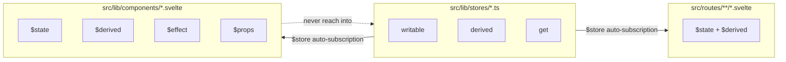
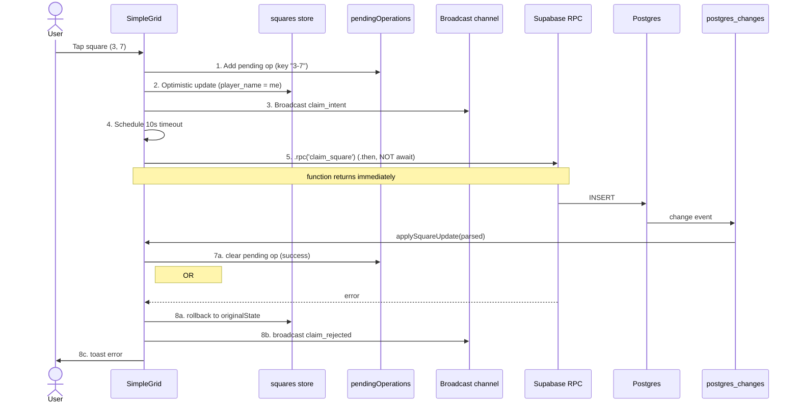
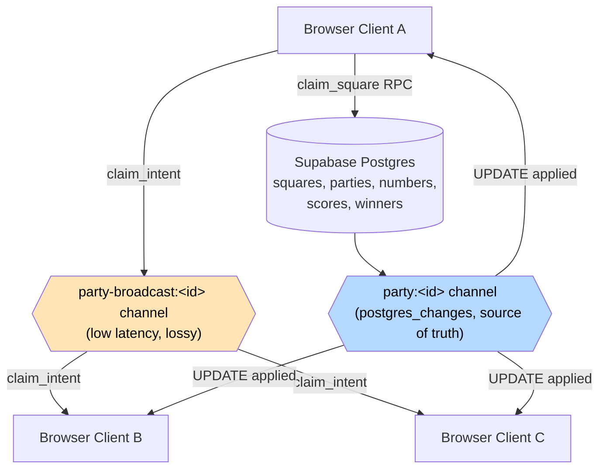
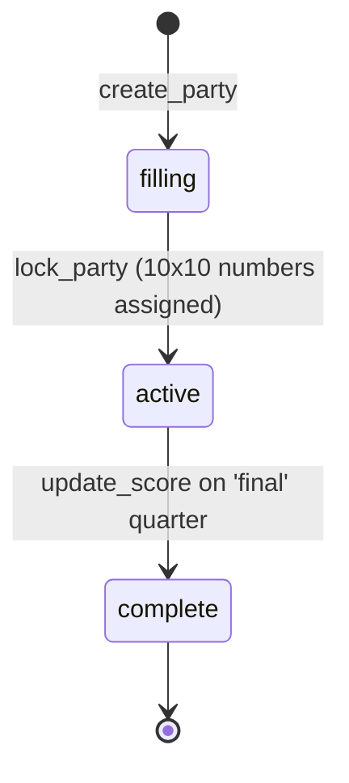

# Architecture

A 10-minute orientation to the Football Squares codebase. If you've cloned the repo and want to understand "where does X live and why" before reading code, start here.

## Tech stack

| Layer              | Choice                                          | Notes                                                                                                                                    |
| ------------------ | ----------------------------------------------- | ---------------------------------------------------------------------------------------------------------------------------------------- |
| Frontend framework | SvelteKit 5                                     | Runes for components, legacy stores for shared state — see [hybrid reactivity](#hybrid-reactivity) below                                 |
| Styling            | Tailwind 4 + CSS variables                      | `app.css` defines theme tokens; component styles use Tailwind utilities + scoped Svelte styles                                           |
| Language           | TypeScript 6 (strict)                           | `--max-warnings 0` on lint; svelte-check in pre-push                                                                                     |
| Backend            | Supabase (Postgres + Realtime)                  | RPCs for writes, postgres_changes + broadcast channels for reads                                                                         |
| Hosting            | Cloudflare Pages / Vercel / Netlify / self-host | `@sveltejs/adapter-auto` picks the matching adapter at build time. Production runs on Cloudflare Pages — see [DEPLOY.md](docs/DEPLOY.md) |
| Observability      | Sentry + Web Vitals                             | Optional — no DSN, no telemetry. See `src/hooks.client.ts`                                                                               |

## Module layout

```
src/
├── routes/
│   ├── +page.svelte              Home (CTA + RecentParties)
│   ├── create/+page.svelte       Create form → createParty service
│   ├── join/+page.svelte         Join form → name conflict / PIN modal
│   └── party/[code]/
│       ├── +page.svelte          Grid + sidebar (mobile + desktop layouts)
│       └── admin/+page.svelte    Host panel: lock grid, enter scores, payouts
├── lib/
│   ├── components/               Reusable UI (Square, SimpleGrid, PartySidebar, …)
│   ├── stores/
│   │   ├── game-state.ts         Writable + derived stores; pure state mutations (apply* fns)
│   │   ├── game-realtime.ts      Channel lifecycle, broadcast send, postgres_changes routing
│   │   ├── game-optimistic.ts    Optimistic claim/unclaim/batch — the 8-step chain
│   │   ├── game-admin.ts         Host-only RPC wrappers (lock, score, payout, delete)
│   │   └── game.ts               Barrel re-export
│   ├── services/
│   │   └── createParty.ts        Wraps the create_party RPC; humanizes errors
│   ├── validators/
│   │   └── realtime.ts           Hand-written runtime guards for postgres_changes payloads
│   ├── types.ts                  Single source of truth for DB-shape types
│   └── supabase.ts               Singleton client
├── hooks.client.ts               Sentry init + Web Vitals (no-op without DSN)
└── hooks.server.ts               Sentry init for the resolved SvelteKit adapter
supabase/
└── migrations/                   Forward-only SQL — never edit existing files
```

## The four key concepts

### Hybrid reactivity

Stores and components use different reactivity primitives intentionally — see [ADR-0001](docs/adr/0001-hybrid-reactivity.md) for the why. The TL;DR diagram:



**Rule:** stores stay on `writable()` / `derived()` because they're shared across many subscribers and need imperative `.set()` / `.update()` from non-component code (e.g., the realtime transport layer). Components stay on runes because that's where Svelte 5's reactivity gradient is most efficient. Don't mix.

### Optimistic update chain

When a user claims a square, the UI updates **before** the server confirms. The 8-step chain documented in `claimSquareOptimistic` handles both the happy path and the rollback. See [ADR-0002](docs/adr/0002-optimistic-chain.md) for why `.then()` instead of `await`.



### Dual realtime channels

Each party page opens **two** Supabase Realtime channels. The broadcast channel is fast but lossy; postgres_changes is the source of truth. See [ADR-0003](docs/adr/0003-dual-realtime-channels.md) for why both.



**Why both:** broadcast lets every client see "Alice is claiming (3,7)" within ~50ms. postgres_changes confirms (or contradicts) within ~300ms. If broadcast is dropped, postgres_changes still corrects the state. Without postgres_changes, two clients could race-claim the same cell with no resolution.

### State machine

Parties move through three statuses:



The `locked` status exists in the DB CHECK constraint and is rendered in the UI, but **no current RPC sets it** — `lock_party` jumps directly to `active`. We keep `locked` in the type so a future RPC can introduce a "scoring not yet started" intermediate without a type-system break.

## What lives where (by question)

- **"How does a square get claimed?"** → `src/lib/stores/game-optimistic.ts` (`claimSquareOptimistic`). The full 8-step chain documented above.
- **"How does a party get created?"** → `src/lib/services/createParty.ts` calls the `create_party` RPC (migration 023). Single transaction; party + 100 squares + scores row land atomically.
- **"How does the grid know about other users' actions?"** → `src/lib/stores/game-realtime.ts` (transport: subscribe / broadcast / postgres_changes routing) calls into `apply*` functions in `src/lib/stores/game-state.ts` (state mutations).
- **"What protects host actions?"** → `lock_party`, `update_score`, `delete_party`, `update_payout_structure` all take a `p_pin` arg verified by `check_pin_lockout` (migration 011). Client never sees the PIN — it's stored in IndexedDB scoped to the party code.
- **"What happens on schema drift?"** → The validators in `src/lib/validators/realtime.ts` reject the payload, log a `console.warn`, and (when Sentry is configured) emit a breadcrumb. The store stays at the last-known-good state until a valid payload arrives.

## Forward-only constraints

These are written to prevent a future contributor from "fixing" them:

- **Migrations are forward-only.** Never edit `001_schema.sql` etc. — write a new numbered migration. The DB has 22 of them, applied in order.
- **`.then()` instead of `await` in optimistic functions** is intentional. The function returns immediately so the UI doesn't block on the RPC. Changing to `await` defeats the entire optimistic UX.
- **`writable()` stores stay legacy.** Don't convert to `$state` — see [ADR-0001](docs/adr/0001-hybrid-reactivity.md).
- **`player_name_lower` is `GENERATED ALWAYS`** in Postgres. Never set it directly in INSERT/UPDATE — write `player_name`, let the column derive itself.
- **`BroadcastMessage.type` strings are a wire protocol.** `claim_intent`, `claim_rejected`, `unclaim_intent`. Changing one without the other breaks all clients silently with no TS error.

## Further reading

- [ADR-0001: Hybrid reactivity](docs/adr/0001-hybrid-reactivity.md)
- [ADR-0002: Optimistic update chain](docs/adr/0002-optimistic-chain.md)
- [ADR-0003: Dual realtime channels](docs/adr/0003-dual-realtime-channels.md)
- [E2E testing strategy](docs/E2E_TESTING.md)
- [Game-day operations runbook](GAME-DAY.md)
- [Security stance](SECURITY.md)
