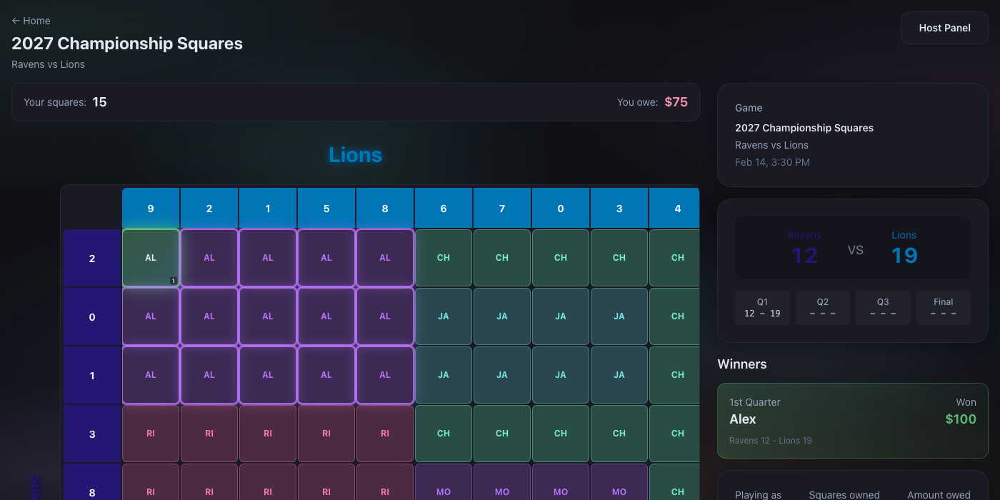
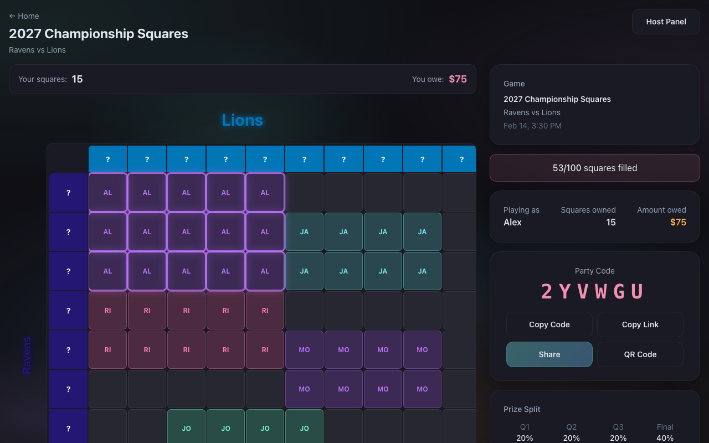
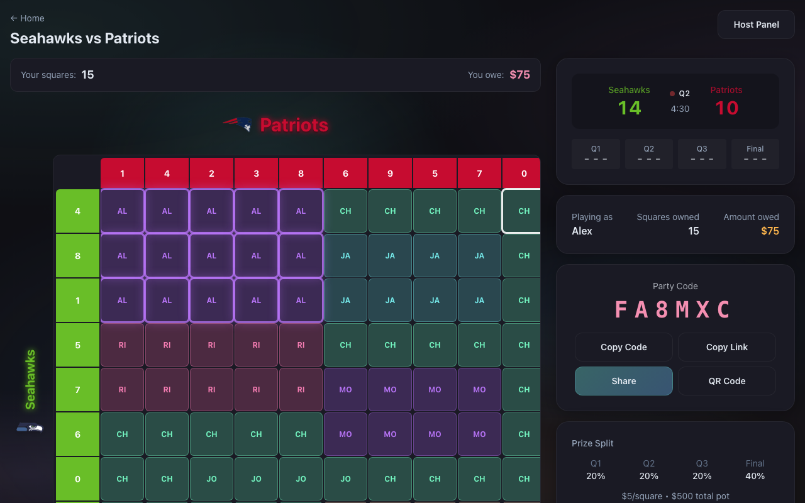
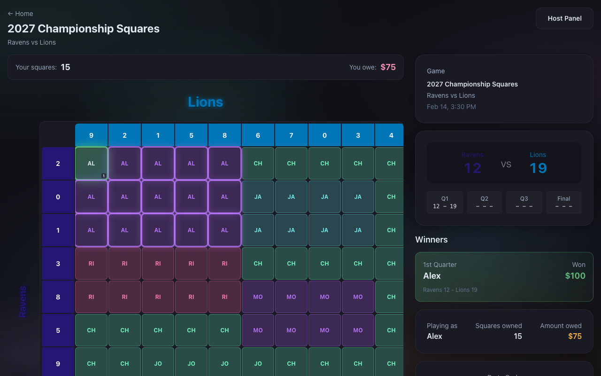
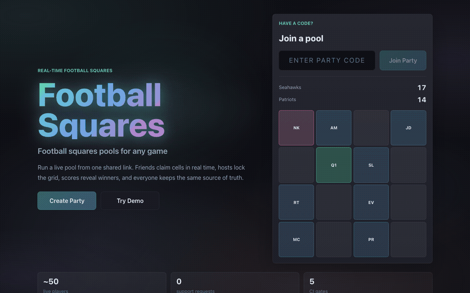

# Football Squares

> Real-time multiplayer Super Bowl pool. Friends claim squares on a 10×10 grid; payouts go to whoever owns the cell whose row/column digits match the score at quarter-end. Built and run on Super Bowl Sunday for ~50 concurrent players.

**[▶ Live Demo — squares.nathankrebs.com](https://squares.nathankrebs.com)**

[](https://github.com/nkrebs13/Squares/releases/latest)
[](https://opensource.org/licenses/MIT)
[](https://github.com/nkrebs13/Squares/actions/workflows/ci.yml)
[](https://kit.svelte.dev)
[](https://supabase.com)
[](https://www.typescriptlang.org)



<p align="center">
  
  
  
</p>

<p align="center"></p>

## Features

- **Real-time grid sync** — sub-100ms cross-client updates via Supabase broadcast + postgres_changes (see [ADR-0003](docs/adr/0003-dual-realtime-channels.md))
- **Optimistic claims with rollback** — taps feel instant; failed claims roll back with a toast (see [ADR-0002](docs/adr/0002-optimistic-chain.md))
- **Custom teams** — set team names, colors, and logos per party; configurable app-wide via env vars
- **Multiple payout structures** — Rising / Equal / Big Finish / Custom
- **Host PIN protection** for grid lock, score entry, payout edits, party deletion
- **PWA installable** on iOS + Android with push notifications
- **ESPN live score auto-detect** — links to the active NFL game without manual setup
- **Color-coded player legend** with click-to-filter
- **Pan and zoom** for usable squares on small phones
- **WCAG 2.1 AA targets** — ARIA grid markup, dialog modal with focus trap, semantic forms

## Tech stack

| Layer         | Choice                                                                                                       |
| ------------- | ------------------------------------------------------------------------------------------------------------ |
| Frontend      | SvelteKit 5 (runes in components, legacy stores in shared state — [why](docs/adr/0001-hybrid-reactivity.md)) |
| Styling       | Tailwind 4 + CSS variables                                                                                   |
| Language      | TypeScript (strict, `--max-warnings 0`)                                                                      |
| Backend       | Supabase (Postgres + Realtime + RPC)                                                                         |
| Hosting       | Cloudflare Pages, Vercel, Netlify, or self-hosted Node — see [DEPLOY.md](docs/DEPLOY.md)                     |
| Observability | Sentry + Web Vitals (optional, no-op without DSN)                                                            |
| Testing       | Vitest (unit + integration) + Playwright (e2e + visual regression)                                           |
| CI            | GitHub Actions — 5 jobs gating every PR                                                                      |

## Why this exists

Office and friend-group "squares" pools usually run via a paper grid + Venmo. Anyone joining late can't see the live grid. Anyone leaving early can't see who won which quarter. The host has to manually track scores against a paper-and-pen grid while paying attention to the actual game.

This app collapses all of that into a shared URL. Friends claim cells in real time, the host enters scores at quarter-end, the app computes winners and shows a payout summary. No accounts, no money flowing through the app — just the bookkeeping.

Ran live on Super Bowl Sunday 2026 with ~50 concurrent players. Zero downtime. Zero support requests.

## Portfolio case study

This repo is intentionally shaped as a full-stack portfolio artifact, not just a weekend UI. The product constraint was a real event with non-technical users, spotty mobile networks, and a host who needed score entry to work while watching the game.

The senior-engineering work is in the operational details: a transactional `create_party` RPC, persisted event identity for arbitrary future football games, source-of-truth Postgres changes paired with low-latency broadcasts, optimistic claims with rollback, PIN-protected host actions, RLS hardening, PWA install support, optional Sentry/Web Vitals, and a game-day runbook. CI gates linting, formatting, type checks, coverage, build, bundle size, Supabase integration tests, and Playwright e2e coverage.

For reviewers, the fastest path is:

- Try the live demo from the home page.
- Read [ARCHITECTURE.md](ARCHITECTURE.md) for the system overview.
- Read [ADR-0002](docs/adr/0002-optimistic-chain.md) and [ADR-0003](docs/adr/0003-dual-realtime-channels.md) for the key realtime decisions.
- Read [GAME-DAY.md](docs/GAME-DAY.md) for the production operations model.

## Quick start

### Prerequisites

- Node 20+
- A [Supabase](https://supabase.com) project (free tier works)

### Installation

```bash
git clone https://github.com/nkrebs13/Squares.git
cd Squares
npm install
cp .env.example .env.local
# Edit .env.local: set VITE_SUPABASE_URL and VITE_SUPABASE_ANON_KEY
npm run dev                   # http://localhost:5173
```

### Database setup

Apply the migrations to your Supabase project:

```bash
# Option A: Supabase CLI (recommended)
supabase link --project-ref <your-ref>
supabase db push
```

```bash
# Option B: SQL Editor — paste each file in numerical order
# supabase/migrations/001_*.sql through the latest numbered migration
```

> [!IMPORTANT]
> **Option B only:** If you apply migrations via the SQL Editor instead of the CLI, also verify that Realtime replication is enabled for the `parties`, `squares`, `numbers`, `scores`, and `winners` tables in **Supabase Dashboard → Database → Replication**. The CLI applies `001_schema.sql` (which contains the `ALTER PUBLICATION supabase_realtime ADD TABLE …` statements) automatically; the SQL Editor does not activate Realtime for you — the grid will appear to work but won't sync across clients in real time.

### Demo data

Running `supabase db reset` applies all migrations and seeds a demo party automatically. After reset, visit `/party/DEMO01` (PIN: `0000`) to see a partially-filled grid with four fictional players. To skip seeding, delete `supabase/seed.sql` before running reset.

> [!TIP]
> The live demo at [squares.nathankrebs.com](https://squares.nathankrebs.com) is always running against a pre-seeded Supabase project. You can explore every game state without setting anything up locally.

### Optional: Error tracking

Set `PUBLIC_SENTRY_DSN` in `.env.local` to send unhandled errors and Web Vitals (CLS, INP, LCP, FCP, TTFB) to a [Sentry](https://sentry.io) project. The free tier is sufficient for portfolio-level traffic; the app works identically with the variable unset.

```env
PUBLIC_SENTRY_DSN=https://...@...ingest.sentry.io/...
```

## Deployment

The repo uses `@sveltejs/adapter-auto`, so the same source ships unchanged to:

- **Cloudflare Pages** — canonical production target ([squares.nathankrebs.com](https://squares.nathankrebs.com) runs here)
- **Vercel** — [](https://vercel.com/new/clone?repository-url=https%3A%2F%2Fgithub.com%2Fnkrebs13%2FSquares&env=VITE_SUPABASE_URL,VITE_SUPABASE_ANON_KEY)
- **Netlify** — [](https://app.netlify.com/start/deploy?repository=https://github.com/nkrebs13/Squares)
- **Self-host (Node)** — drop in `@sveltejs/adapter-node` per the guide

Full step-by-step instructions, env-var lists, custom-domain notes, and troubleshooting in [`docs/DEPLOY.md`](docs/DEPLOY.md).

### Customizing your fork

Brand strings, default event/team labels, and currency live in [`src/lib/config.ts`](src/lib/config.ts) and read from `PUBLIC_*` env vars at build time. To rebrand without touching code, set the relevant entries in `.env.local` (or your platform's env-var dashboard) before `npm run build`:

| Env var                         | Default                                |
| ------------------------------- | -------------------------------------- |
| `PUBLIC_APP_NAME`               | `Football Squares`                     |
| `PUBLIC_APP_URL`                | `https://squares.nathankrebs.com`      |
| `PUBLIC_APP_TAGLINE`            | `Super Bowl party pools made easy`     |
| `PUBLIC_APP_DESCRIPTION`        | `Real-time Super Bowl squares pool. …` |
| `PUBLIC_DEMO_PARTY_CODE`        | `DEMO01`                               |
| `PUBLIC_DEFAULT_EVENT_NAME`     | `Football Squares`                     |
| `PUBLIC_DEFAULT_TEAM_ROW_NAME`  | `Seahawks`                             |
| `PUBLIC_DEFAULT_TEAM_ROW_COLOR` | `#69BE28`                              |
| `PUBLIC_DEFAULT_TEAM_ROW_LOGO`  | `/logos/seahawks.png`                  |
| `PUBLIC_DEFAULT_TEAM_COL_NAME`  | `Patriots`                             |
| `PUBLIC_DEFAULT_TEAM_COL_COLOR` | `#C60C30`                              |
| `PUBLIC_DEFAULT_TEAM_COL_LOGO`  | `/logos/patriots.png`                  |
| `PUBLIC_CURRENCY_CODE`          | `USD` (any ISO 4217 code)              |
| `PUBLIC_LOCALE`                 | `en-US` (any BCP 47 locale)            |

`PUBLIC_APP_NAME` and `PUBLIC_APP_DESCRIPTION` are also picked up by the PWA manifest in `vite.config.ts`. All values fall back to the defaults above when unset, so a stock fork keeps the Football Squares experience.

> [!NOTE]
> Team names and colors can also be set **per party** from the create-party form — the env vars set the defaults pre-populated in the form.

## Architecture

The 10-minute orientation is in [ARCHITECTURE.md](ARCHITECTURE.md). The deepest design decisions get their own ADRs:

- [ADR-0001: Hybrid reactivity](docs/adr/0001-hybrid-reactivity.md) — why stores stay legacy and components use runes
- [ADR-0002: Optimistic update chain](docs/adr/0002-optimistic-chain.md) — why `.then()` instead of `await`, and what the 8 steps are
- [ADR-0003: Dual realtime channels](docs/adr/0003-dual-realtime-channels.md) — why both broadcast AND postgres_changes

> [!NOTE]
> Each ADR documents the options considered, the tradeoffs weighed, and the decision made — not just what was built, but why. This is the fastest path to understanding the non-obvious design choices.

If you've cloned the repo and want to know "where does X live and why", that's the path.

For production operations, see [GAME-DAY.md](docs/GAME-DAY.md) — the runbook used on Super Bowl Sunday, covering Supabase monitoring, emergency SQL for stuck party states, service worker cache clearing, and broadcast channel health diagnosis.

## Development

```bash
npm run dev                        # http://localhost:5173
npm run test                       # unit tests (Vitest)
npm run test:e2e                   # Playwright (Chromium + Mobile Chrome)
npm run lint && npm run check      # quality gates
```

See [CONTRIBUTING.md](CONTRIBUTING.md) for local Supabase setup, testing strategy, and contribution guidelines.

## Contributing

Please read our [Code of Conduct](CODE_OF_CONDUCT.md) before participating.

1. Branch from `main`
2. Run `npm run lint && npm run check && npm run test` locally
3. Open a PR; CI must be green before merge

## License

MIT — see [LICENSE](LICENSE).

## Author

Built by [Nathan Krebs](https://github.com/nkrebs13). Originally for Super Bowl 2026 with friends; now public as a portfolio piece.
